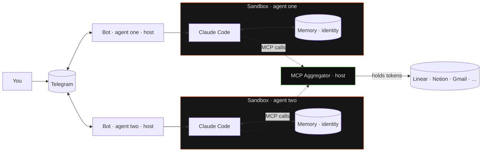

# RightClaw

<p align="center">
  <b>the proper claude code runtime</b><br/>
  a fleet of claude code agents — one telegram thread each,
  sandboxed, with memory that survives restarts.<br/>
  runs on your $20 claude subscription.
</p>

<p align="center">
  <a href="LICENSE"></a>
  <a href="https://github.com/onsails/rightclaw/actions"></a>
  <a href="https://t.me/rightclaww">Telegram</a>
</p>

## Quick Start

Prerequisites:

- [Claude Code CLI](https://docs.anthropic.com/en/docs/claude-code)
- Telegram bot token from [@BotFather](https://t.me/BotFather)
- [cloudflared](https://developers.cloudflare.com/cloudflare-one/connections/connect-networks/) with a named tunnel (for Telegram webhook ingress)

```sh
curl -LsSf https://raw.githubusercontent.com/onsails/rightclaw/master/install.sh | sh
rightclaw init
rightclaw up
```

Full install guide: [docs/INSTALL.md](docs/INSTALL.md).

## What you get out of the box

### A fleet of Claude Code agents

Each agent is a separate Claude Code session inside its own sandbox. Separate identity, separate memory, separate Telegram thread. All of them run on your Claude subscription — no API keys, no per-agent billing.

### Memory and evolving identity

Managed with Hindsight Cloud for semantic recall (append-only), or as a plain `MEMORY.md` file the agent curates itself. Either way, memory survives restarts and compounds over time. Each agent also writes its own identity and personality on first launch. Details below.

### MCP without the breach

Every MCP server is a credential. Your Linear token. Your Notion OAuth. Your Gmail. Your production Sentry.

In most agent setups, those secrets are directly reachable to the agent — on disk, in environment variables, in its config files. No sandbox, no credential provider. One prompt injection — one compromised webpage the agent reads, one malicious memory, one leaky skill — and the attacker walks away with your workspace, your mailbox, your customer data. Possibly worse.

RightClaw runs a single MCP aggregator on the host, outside every sandbox. Your secrets live there. Agents talk to the aggregator, the aggregator talks to the MCP server. The agent never sees the token.

- OAuth, bearer, custom header, query-string — all four auth patterns, auto-detected
- Tokens refresh automatically, silently
- Compromised agent? Worst case it misuses the MCP. It can never exfiltrate the key.

This is what `right by default` means.

### Everything in Telegram

Claude login, MCP OAuth, file attachments in both directions, cron notifications, `/doctor`, `/reset` — one thread. The terminal is needed exactly once: to run `rightclaw up`.

## Self-evolving by design

### Identity that writes itself

The first session with a fresh agent is not a chat — it's a bootstrap. The agent answers questions about who it wants to be: name, tone, boundaries, relationship with the user. It writes `IDENTITY.md`, `SOUL.md`, `USER.md` in its own hand. From then on, those files ride along in every system prompt — on every restart, on every model swap, on every upgrade. The agent is the author of its own persona, and that authorship sticks.

### Memory

Two modes, one switch in `agent.yaml`.

- **Hindsight** — managed semantic memory cloud. Append-only: every turn auto-retains a delta, next turn auto-recalls what matters. Per-chat tagging, prefetch cache. The agent remembers who it is talking to, what it was working on yesterday, and which stack the user runs — without replaying the whole transcript.
- **`MEMORY.md`** — local file, curated by the agent itself via Claude Code's Edit/Write tools. For anyone who does not want a cloud dependency.

Either way, memory survives restarts. Nothing resets when you `rightclaw up` again.

### One channel, one memory, one identity

Most agent runtimes give you fifty knobs and call configuration a feature. RightClaw gives you one well-worn path — Telegram chat, memory that compounds, evolving identity — and polishes it end-to-end.

No pluggable memory engines. No matrix of chat backends. No twelve ways to configure a personality. No opt-in sandbox (it's on by default).

### What is not here yet

Auto-skills — where an agent writes its own skills from repeated tasks — is not shipped. Skills today are hand-written or installed from third-party sources. The skill format is compatible with [skills.sh](https://skills.sh).

## Architecture

The sandbox layer is [**NVIDIA OpenShell**](https://github.com/NVIDIA/OpenShell) — purpose-built for AI agents, not a container runtime stretched to fit.



### Blast radius, contained

The agent reads a poisoned webpage. A skill turns out to be hostile. An MCP returns a prompt injection. These things happen.

In RightClaw, those scenarios break one sandbox — not your machine, not your files, not another agent. The agent can read and write only inside its own sandbox workspace. There is no way out of the sandbox for it.

### You see what leaves — and you decide

Every outbound request passes through OpenShell's policy engine, which terminates TLS and enforces a domain allowlist. Full request logging — nothing leaves the sandbox without a record.

The network policy is permissive by default. One line in `agent.yaml` flips to restrictive: the agent can reach Anthropic and Claude endpoints, and nothing else.

### Your secrets stay yours

MCP tokens and OAuth refresh tokens live on the host, inside the aggregator. In the sandbox: only proxy endpoints, never the raw credential. Claude auth is handled by the bot and injected per invocation — there is no persistent credential file sitting inside the sandbox.

OpenShell can go further still: a credential provider layer that replaces tokens with opaque placeholders inside the sandbox and substitutes the real secrets only at egress — so that `gh`, `gcloud`, `aws`, `kubectl` work normally while `echo $GITHUB_TOKEN` returns a useless string. Wiring this into RightClaw is the next roadmap item; the infrastructure is already in OpenShell.

### One control plane

After `rightclaw up`, the terminal is done. Claude login, MCP authorisation, file exchange, cron notifications — one Telegram thread.

---

Sandboxing for appearance's sake is a dead formality. A sandbox in which an agent actually lives — for months, across restarts, upgrading, talking to the outside world through a policy engine — is infrastructure work. NVIDIA did that work in OpenShell. We use it.

Without it, an agent lives in a plain container with no rules on it. For a demo, that is enough. To leave agents running while you sleep — it is not.

## How it compares

| | Typical multi-agent runtime | RightClaw |
|---|---|---|
| **Sandbox** | plain container, no built-in rules | OpenShell: policy engine, TLS inspection |
| **Credential exposure** | tokens live inside agent env and files | tokens held by host-side aggregator, agents never touch them |
| **MCP secrets** | copied into every agent | single aggregator; agents never see them |
| **Memory** | replay full history each turn | append-only; Hindsight or local file |
| **Identity** | system prompt in a config file | agent writes its own IDENTITY.md / SOUL.md |
| **Control surface** | CLI + config files + dashboards | one Telegram thread |
| **Claude billing** | requires API key per agent | one Claude subscription, any number of agents |
| **Scope** | configurable everything | one opinionated path, polished end-to-end |

Other runtimes optimise for flexibility and breadth — you can wire anything to anything. RightClaw optimises for a single well-worn path: Telegram in, sandboxed Claude Code out, with memory and identity that outlive restarts.

## Roadmap

**Shipped**
- [x] Multi-agent orchestration, sandboxed by default
- [x] MCP aggregator — OAuth, bearer, header, query-string
- [x] Evolving identity: agent writes its own IDENTITY.md / SOUL.md / USER.md
- [x] Append-only memory: Hindsight Cloud or local MEMORY.md
- [x] Telegram as single control plane: login, MCP auth, files, cron
- [x] Telegram group chats and thread routing
- [x] Media groups (albums, mixed attachments) in both directions
- [x] Declarative cron with Telegram notifications
- [x] Agent backup & restore (`rightclaw agent backup` / `--from-backup`)
- [x] `rightclaw doctor` end-to-end diagnostics

**Next**
- [ ] OpenShell credential providers for `gh`, `gcloud`, `aws`, `kubectl` — zero-token CLIs inside sandboxes
- [ ] Agent templates — shareable configs with MCPs, skills, identity presets
- [ ] Auto-skills — agent writes its own skills from repeated tasks
- [ ] Per-turn budget caps for chat messages (currently cron-only)
- [ ] Agent-to-agent communication

Full project tracker on [GitHub Issues](https://github.com/onsails/rightclaw/issues).

## Docs

- [Installation](docs/INSTALL.md) — full prerequisites
- [Security model](docs/SECURITY.md) — policies, credential isolation, threat model
- [Architecture](ARCHITECTURE.md) — internal topology, SQLite schema, invocation contract
- [Prompting system](PROMPT_SYSTEM.md) — how agent system prompts are assembled

## License

Apache-2.0. Use it, fork it, ship it.

## Credits

Built on [Claude Code](https://docs.anthropic.com/en/docs/claude-code), [NVIDIA OpenShell](https://github.com/NVIDIA/OpenShell), and [process-compose](https://github.com/F1bonacc1/process-compose).
