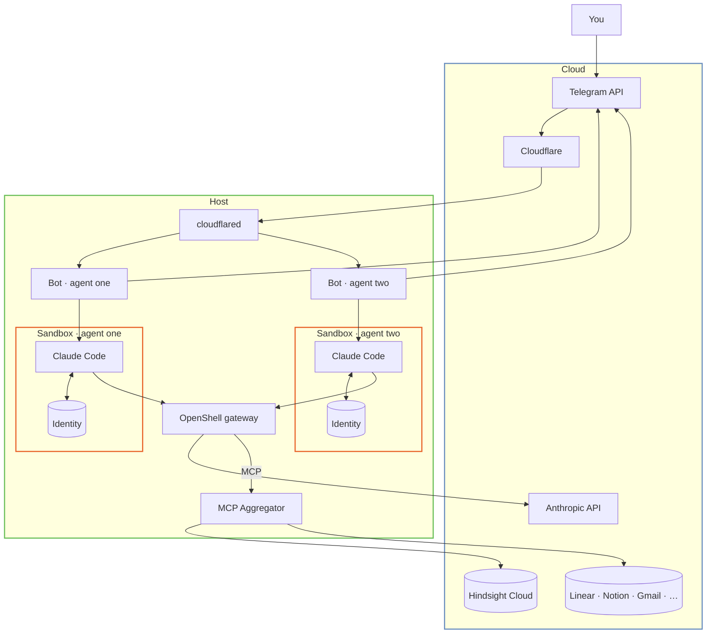

<p align="center">
  
</p>

<p align="center">
  <a href="LICENSE"></a>
  <a href="https://github.com/onsails/right-agent/actions"></a>
  <a href="https://t.me/rightclaw"></a>
</p>

<p align="center">
  <b>the proper claude code runtime</b><br/>
  telegram-native · sandboxed by default · runs on your $20 claude subscription
</p>

<p align="center">
  
</p>

<p align="center">
  <a href="#the-problem">the problem</a> ·
  <a href="#what-we-picked-for-you">what we picked for you</a> ·
  <a href="#quick-start">quick start</a> ·
  <a href="#what-you-get">what you get</a> ·
  <a href="#how-it-stays-safe">how it stays safe</a> ·
  <a href="#how-it-compares">how it compares</a> ·
  <a href="#roadmap">roadmap</a>
</p>

## the problem

in most agent setups, the agent you leave running long-term has two problems baked in.

tokens sit in a plaintext config file. the sandbox is missing or fake. context resets on restart. enough for a demo, not for what you depend on.

and getting even that far costs a weekend: a chat backend, a memory store, a tunnel, a sandbox layer — pick them, wire them. the agent works on monday. it didn't have to take a weekend.

right agent fixes both. the pieces are picked, the wiring is done, telegram is your only console.

## what we picked for you

every agent inside its own sandbox. security first; usability never sacrificed for it. nothing else gets a vote.

we make the choices for you and polish what we ship. the box is closed:

- **chat surface.** telegram. dm, groups, topics — polished, with attachments both ways, media groups, voice notes. not a matrix of telegram + slack + discord + web ui.
- **memory.** [hindsight cloud](https://hindsight.vectorize.io) (semantic recall, recommended) or local `MEMORY.md` (no cloud dependency). picked at agent init.
- **model provider.** your claude subscription. `claude -p`, no api keys per agent.
- **tunnel.** cloudflared. free, secure, production-grade.
- **sandbox.** [nvidia openshell](https://github.com/NVIDIA/OpenShell), on by default. the only opt-out is for agents that need host access (e.g. computer-use, browser automation), and that's set explicitly per-agent.

the consequence: features arrive slowly. we polish what's here before adding what's next. if a knob isn't exposed, we haven't found a way to add it without making the product worse for everyone already using it.

## quick start

prerequisites:

- [claude code cli](https://docs.anthropic.com/en/docs/claude-code)
- telegram bot token from [@BotFather](https://t.me/BotFather)
- [cloudflared](https://developers.cloudflare.com/cloudflare-one/connections/connect-networks/) authenticated with a [cloudflare account](https://dash.cloudflare.com/sign-up) (for telegram webhook ingress)
- [hindsight cloud](https://hindsight.vectorize.io) api key (optional, for semantic memory)

```sh
curl -LsSf https://raw.githubusercontent.com/onsails/right-agent/master/install.sh | sh
right init
right up
```

full install guide: [docs/INSTALL.md](docs/INSTALL.md).

## what you get

### multiple agents on one subscription

each agent is a separate claude code session in its own sandbox: separate identity, separate memory, separate telegram thread. no per-agent api key. all of them run on your one claude subscription.

### memory that survives restarts

two memory backends, picked at agent init.

**[hindsight cloud](https://hindsight.vectorize.io)** stores every turn append-only and recalls what's relevant on the next turn, scoped per-chat. the agent remembers who you are, what you were working on yesterday, and which stack you run, without replaying the whole transcript.

**`MEMORY.md`** is a local file the agent maintains itself. no cloud, no semantic recall, simpler.

### identity that writes itself

the first session with a fresh agent is a bootstrap, not a chat. the agent answers questions about who it wants to be (name, tone, boundaries, relationship with you) and writes `IDENTITY.md`, `SOUL.md`, `USER.md` itself. those files load into every system prompt afterwards. on restart, on model swap, on upgrade, the agent stays itself.

### one place to run it from

after `right up`, the terminal is done. claude login, mcp authorization, file attachments, cron notifications, `/doctor`, `/reset`. all in telegram.

## how it stays safe

an agent you leave running long-term will eventually fetch a poisoned webpage, install a hostile skill, or accept a malicious memory through an mcp tool. the design assumes this. what matters is what the agent can reach when it does.

on a typical agent setup, the agent has direct access to:

- every mcp token in `.mcp.json`: linear, notion, gmail, sentry, github
- your claude oauth refresh token
- your `~/.ssh` and dotfiles
- your source tree
- your `~/.aws`, `~/.config/gcloud`, kubectl configs
- any `.env` file under your home directory
- the workspace and memory of every other agent on the host

one compromised turn, the attacker walks out with all of it.

### the sandbox boundary

every claude code session runs inside an [nvidia openshell](https://github.com/NVIDIA/OpenShell) sandbox. the agent reads and writes only inside its own workspace. nothing in `~/.ssh`, `~/.aws`, `~/.config/gcloud`, or your source tree is reachable. no other agent's files are reachable. no escape route.

openshell is purpose-built for ai agents, not a container runtime stretched to fit. tls inspection, domain allowlists, and request logging are per-sandbox primitives.

### credentials live outside the sandbox

mcp tokens, oauth refresh tokens, and claude auth live on the host inside a single aggregator process. the sandbox sees a proxy endpoint, never the raw token. four auth patterns are detected and refreshed automatically: oauth, bearer, custom header, query string.

worst case for a compromised agent: it misuses a tool while it's running. it cannot exfiltrate the credential.

### the topology

<details>
<summary>show diagram</summary>



</details>

### what egress looks like

outbound traffic from the sandbox goes through openshell's policy engine. tls is terminated per-request. the destination is matched against the domain allowlist, and the request is logged. nothing leaves silently.

the default policy is permissive. one line in `agent.yaml` switches to restrictive: anthropic and claude endpoints only.

## how it compares

| | typical multi-agent runtime | right agent |
|---|---|---|
| sandbox | container, no built-in rules | openshell: policy engine, tls inspection |
| credentials | tokens live next to the agent | host-side aggregator; agents never see them |
| mcp secrets | copied into every agent | one aggregator, one location |
| memory | replay full history each turn | append-only; hindsight or local file |
| identity | system prompt in a config file | agent writes its own identity files |
| control surface | cli + config + dashboards | one telegram thread |
| claude billing | api key per agent | one claude subscription |
| scope | configurable everything | one opinionated path |

other runtimes ship breadth and leave the wiring to you. right agent ships one path and does the wiring itself.

## roadmap

shipped:
- multi-agent orchestration, sandboxed by default
- mcp aggregator with auto-detected oauth, bearer, header, query-string auth
- evolving identity: agent writes its own `IDENTITY.md` / `SOUL.md` / `USER.md`
- append-only memory: hindsight cloud or local `MEMORY.md`
- telegram as single control plane: login, mcp auth, files, cron
- group chats, topic routing, media groups in both directions
- declarative cron with telegram notifications
- agent backup & restore
- `right doctor` end-to-end diagnostics

next:
- credential providers for `gh`, `gcloud`, `aws`, `kubectl`: zero-token clis inside sandboxes
- native browser automation
- agent templates: shareable configs with mcps, skills, identity presets
- auto-skills: agent writes its own skills from repeated tasks
- per-turn budget caps for chat (currently cron-only)
- agent-to-agent communication

full tracker on [github issues](https://github.com/onsails/right-agent/issues).

## docs

- [installation](docs/INSTALL.md) — full prerequisites
- [security model](docs/SECURITY.md) — policies, credential isolation, threat model
- [architecture](ARCHITECTURE.md) — internal topology, sqlite schema, invocation contract
- [prompting system](PROMPT_SYSTEM.md) — how agent system prompts are assembled

## license

apache-2.0.

## credits

built on [claude code](https://docs.anthropic.com/en/docs/claude-code), [nvidia openshell](https://github.com/NVIDIA/OpenShell), and [process-compose](https://github.com/F1bonacc1/process-compose).
