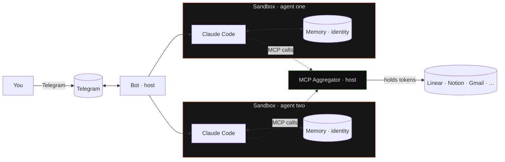

# README Relaunch Implementation Plan

> **For agentic workers:** REQUIRED SUB-SKILL: Use superpowers:subagent-driven-development (recommended) or superpowers:executing-plans to implement this plan task-by-task. Steps use checkbox (`- [ ]`) syntax for tracking.

**Goal:** Replace `README.md` at repo root with the viral-launch version specified in `docs/superpowers/specs/2026-04-19-readme-relaunch-design.md`.

**Architecture:** Single-file rewrite with three preflight decisions (Telegram chat URL, demo GIF availability, wordmark SVG availability) that gate three optional hero elements. The new README is assembled from the spec's eight section definitions into a single Markdown file, then passes a guardrail pass (banned-token grep, structure check, broken-link check) before commit.

**Tech Stack:** Markdown with GitHub Flavored Markdown extensions, inline Mermaid (rendered by GitHub). No build, no code. Verification via shell commands (`rg`, `awk`, `wc`).

---

## File Structure

- **Create/overwrite:** `<repo root>/README.md` — the new document (~280 lines).
- **Read-only reference:** `<repo root>/docs/superpowers/specs/2026-04-19-readme-relaunch-design.md` — the spec.
- **Assets consumed (conditional):**
  - `<repo root>/docs/assets/rightclaw-wordmark.svg` (hero logo; fallback to plain H1 if missing)
  - `<repo root>/docs/assets/demo.gif` (hero demo; line omitted if missing)

No other files are created or modified by this plan.

---

## Task 1: Preflight — collect decisions for conditional hero elements

**Files:** none (this task records three decisions in the implementer's head / chat, to be consumed by Task 2).

**Three decisions to record, in order:**

- [ ] **Step 1: Check wordmark SVG availability**

Run:
```sh
test -f <repo root>/docs/assets/rightclaw-wordmark.svg && echo FOUND || echo MISSING
```

Record: `WORDMARK = FOUND` or `WORDMARK = MISSING`.
- If FOUND → Task 2 uses the `` hero.
- If MISSING → Task 2 uses a plain `# RightClaw` H1 at the top and does NOT emit the `` tag. Do not try to generate an SVG.

- [ ] **Step 2: Check demo GIF availability**

Run:
```sh
test -f <repo root>/docs/assets/demo.gif && echo FOUND || echo MISSING
```

Record: `DEMO_GIF = FOUND` or `DEMO_GIF = MISSING`.
- If FOUND → Task 2 includes the GIF line at the bottom of the hero.
- If MISSING → Task 2 OMITS the entire `<p align="center">...</p>` block. Do not leave a broken-image tag. Do not use a placeholder URL.

- [ ] **Step 3: Collect Telegram chat URL from the user**

Ask the user: *"Give me the public Telegram chat/channel URL for the hero badge row, or say 'skip' if the chat is not yet created."*

Record: `TELEGRAM_URL = "https://t.me/..."` or `TELEGRAM_URL = SKIP`.
- If URL provided → Task 2 emits the Telegram badge line in the badge row with the supplied URL.
- If SKIP → Task 2 emits the badge row WITHOUT the Telegram badge. Do not leave `TELEGRAM_CHAT_URL_PLACEHOLDER` in the file.

- [ ] **Step 4: Echo decisions back**

Print the three decisions in one block for the user to confirm:

```
WORDMARK    = <FOUND|MISSING>
DEMO_GIF    = <FOUND|MISSING>
TELEGRAM_URL = <url|SKIP>
```

Wait for user confirmation before proceeding.

---

## Task 2: Write the new README.md

**Files:**
- Create (overwrite): `<repo root>/README.md`

This task produces the entire new file content in one write. The content below is the final document in the `WORDMARK=FOUND, DEMO_GIF=FOUND, TELEGRAM_URL=provided` case. Apply the three conditional edits described at the bottom of this task.

- [ ] **Step 1: Write README.md with the content below**

Content to write (full file):

````markdown
<p align="center">
  
</p>

<p align="center">
  <b>the proper claude code runtime</b><br/>
  a fleet of claude code agents — one telegram thread each,
  sandboxed, with memory that survives restarts.<br/>
  runs on your $20 claude subscription.
</p>

<p align="center">
  <a href="https://crates.io/crates/rightclaw-cli"></a>
  <a href="LICENSE"></a>
  <a href="https://github.com/onsails/rightclaw/actions"></a>
  <a href="TELEGRAM_URL_HERE">Telegram</a>
</p>

<p align="center">
  
</p>

## Quick Start

Prerequisites:

- [Claude Code CLI](https://docs.anthropic.com/en/docs/claude-code)
- Telegram bot token from [@BotFather](https://t.me/BotFather)
- [cloudflared](https://developers.cloudflare.com/cloudflare-one/connections/connect-networks/) with a named tunnel

```sh
curl -LsSf https://raw.githubusercontent.com/onsails/rightclaw/master/install.sh | sh
rightclaw init --telegram-token <YOUR_BOT_TOKEN>
rightclaw up
```

Full install guide: [docs/INSTALL.md](docs/INSTALL.md).

## What you get out of the box

### A fleet of Claude Code agents

Each agent is a separate Claude Code session inside its own sandbox. Separate identity, separate memory, separate Telegram thread. All of them run on your Claude subscription — no API keys, no per-agent billing.

### Memory and evolving identity

Managed with Hindsight Cloud for semantic recall (append-only), or as a plain `MEMORY.md` file the agent curates itself. Either way, memory survives restarts and compounds over time. Each agent also writes its own identity and personality on first launch. Details below.

### MCP without the breach

Every MCP server is a credential. Your Linear token. Your Notion OAuth. Your Gmail. Your production Sentry.

In most agent setups, those secrets are directly reachable to the agent — on disk, in environment variables, in its config files. No sandbox, no credential provider. One prompt injection — one compromised webpage the agent reads, one malicious memory, one leaky skill — and the attacker walks away with your workspace, your mailbox, your customer data. Possibly worse.

RightClaw runs a single MCP aggregator on the host, outside every sandbox. Your secrets live there. Agents talk to the aggregator, the aggregator talks to the MCP server. The agent never sees the token.

- OAuth, bearer, custom header, query-string — all four auth patterns, auto-detected
- Tokens refresh automatically, silently
- Compromised agent? Worst case it misuses the MCP. It can never exfiltrate the key.

This is what `right by default` means.

### Everything in Telegram

Claude login, MCP OAuth, file attachments in both directions, cron notifications, `/doctor`, `/reset` — one thread. The terminal is needed exactly once: to run `rightclaw up`.

## Self-evolving by design

### Identity that writes itself

The first session with a fresh agent is not a chat — it's a bootstrap. The agent answers questions about who it wants to be: name, tone, boundaries, relationship with the user. It writes `IDENTITY.md`, `SOUL.md`, `USER.md` in its own hand. From then on, those files ride along in every system prompt — on every restart, on every model swap, on every upgrade. The agent is the author of its own persona, and that authorship sticks.

### Memory

Two modes, one switch in `agent.yaml`.

- **Hindsight** — managed semantic memory cloud. Append-only: every turn auto-retains a delta, next turn auto-recalls what matters. Per-chat tagging, prefetch cache. The agent remembers who it is talking to, what it was working on yesterday, and which stack the user runs — without replaying the whole transcript.
- **`MEMORY.md`** — local file, curated by the agent itself via Claude Code's Edit/Write tools. For anyone who does not want a cloud dependency.

Either way, memory survives restarts. Nothing resets when you `rightclaw up` again.

### One channel, one memory, one identity

Most agent runtimes give you fifty knobs and call configuration a feature. RightClaw gives you one well-worn path — Telegram chat, memory that compounds, evolving identity — and polishes it end-to-end.

No pluggable memory engines. No matrix of chat backends. No twelve ways to configure a personality. No opt-in sandbox (it's on by default).

### What is not here yet

Auto-skills — where an agent writes its own skills from repeated tasks — is not shipped. Skills today are hand-written or installed from third-party sources. The skill format is compatible with [skills.sh](https://skills.sh).

## Architecture

The sandbox layer is [**NVIDIA OpenShell**](https://github.com/NVIDIA/OpenShell) — purpose-built for AI agents, not a container runtime stretched to fit.



### Blast radius, contained

The agent reads a poisoned webpage. A skill turns out to be hostile. An MCP returns a prompt injection. These things happen.

In RightClaw, those scenarios break one sandbox — not your machine, not your files, not another agent. The agent can read and write only inside its own sandbox workspace. There is no way out of the sandbox for it.

### You see what leaves — and you decide

Every outbound request passes through OpenShell's policy engine, which terminates TLS and enforces a domain allowlist. Full request logging — nothing leaves the sandbox without a record.

Permissive by default. One line in `agent.yaml` flips to restrictive: the agent can reach Anthropic and Claude endpoints, and nothing else.

### Your secrets stay yours

MCP tokens and OAuth refresh tokens live on the host, inside the aggregator. In the sandbox: only proxy endpoints, never the raw credential. Claude auth is handled by the bot and injected per invocation — there is no persistent credential file sitting inside the sandbox.

OpenShell can go further still: a credential provider layer that replaces tokens with opaque placeholders inside the sandbox and substitutes the real secrets only at egress — so that `gh`, `gcloud`, `aws`, `kubectl` work normally while `echo $GITHUB_TOKEN` returns a useless string. Wiring this into RightClaw is the next roadmap item; the infrastructure is already in OpenShell.

### One control plane

After `rightclaw up`, the terminal is done. Claude login, MCP authorisation, file exchange, cron notifications — one Telegram thread.

---

Sandboxing for appearance's sake is a dead formality. A sandbox in which an agent actually lives — for months, across restarts, upgrading, talking to the outside world through a policy engine — is infrastructure work. NVIDIA did that work in OpenShell. We use it.

Without it, an agent lives in a plain container with no rules on it. For a demo, that is enough. To leave agents running while you sleep — it is not.

## How it compares

| | Typical multi-agent runtime | RightClaw |
|---|---|---|
| **Sandbox** | plain container, no built-in rules | OpenShell: policy engine, TLS inspection |
| **Credential exposure** | tokens live inside agent env and files | tokens held by host-side aggregator, agents never touch them |
| **MCP secrets** | copied into every agent | single aggregator; agents never see them |
| **Memory** | replay full history each turn | append-only; Hindsight or local file |
| **Identity** | system prompt in a config file | agent writes its own IDENTITY.md / SOUL.md |
| **Control surface** | CLI + config files + dashboards | one Telegram thread |
| **Claude billing** | requires API key per agent | one Claude subscription, any number of agents |
| **Scope** | configurable everything | one opinionated path, polished end-to-end |

Other runtimes optimise for flexibility and breadth — you can wire anything to anything. RightClaw optimises for a single well-worn path: Telegram in, sandboxed Claude Code out, with memory and identity that outlive restarts.

## Roadmap

**Shipped**
- [x] Multi-agent orchestration, sandboxed by default
- [x] MCP aggregator — OAuth, bearer, header, query-string
- [x] Evolving identity: agent writes its own IDENTITY.md / SOUL.md / USER.md
- [x] Append-only memory: Hindsight Cloud or local MEMORY.md
- [x] Telegram as single control plane: login, MCP auth, files, cron
- [x] Telegram group chats and thread routing
- [x] Media groups (albums, mixed attachments) in both directions
- [x] Declarative cron with Telegram notifications
- [x] Agent backup & restore (`rightclaw agent backup` / `--from-backup`)
- [x] `rightclaw doctor` end-to-end diagnostics

**Next**
- [ ] OpenShell credential providers for `gh`, `gcloud`, `aws`, `kubectl` — zero-token CLIs inside sandboxes
- [ ] Agent templates — shareable configs with MCPs, skills, identity presets
- [ ] Auto-skills — agent writes its own skills from repeated tasks
- [ ] Per-turn budget caps for chat messages (currently cron-only)
- [ ] Agent-to-agent communication

Full project tracker on [GitHub Issues](https://github.com/onsails/rightclaw/issues).

## Docs

- [Installation](docs/INSTALL.md) — full prerequisites
- [Security model](docs/SECURITY.md) — policies, credential isolation, threat model
- [Architecture](ARCHITECTURE.md) — internal topology, SQLite schema, invocation contract
- [Prompting system](PROMPT_SYSTEM.md) — how agent system prompts are assembled

## License

Apache-2.0. Use it, fork it, ship it.

## Credits

Built on [Claude Code](https://docs.anthropic.com/en/docs/claude-code), [NVIDIA OpenShell](https://github.com/NVIDIA/OpenShell), and [process-compose](https://github.com/F1bonacc1/process-compose).
````

- [ ] **Step 2: Apply the three conditional edits from Task 1**

Based on the decisions recorded in Task 1, edit the file just written:

**Conditional A — Wordmark.**
- If `WORDMARK = FOUND`: keep the `<p align="center"></p>` block as-is.
- If `WORDMARK = MISSING`: replace that `<p>...</p>` block with a plain Markdown line `# RightClaw` (standalone H1 on its own line, followed by a blank line).

**Conditional B — Demo GIF.**
- If `DEMO_GIF = FOUND`: keep the `<p align="center"></p>` block as-is.
- If `DEMO_GIF = MISSING`: delete the entire `<p align="center"></p>` block, including the blank line after it. Do not leave a placeholder comment.

**Conditional C — Telegram URL.**
- If `TELEGRAM_URL` is a real URL: replace `TELEGRAM_URL_HERE` in the badge row with that URL.
- If `TELEGRAM_URL = SKIP`: delete the entire `<a href="TELEGRAM_URL_HERE">Telegram</a>` anchor (including any surrounding whitespace that would leave awkward gaps). Keep the other three badges.

- [ ] **Step 3: Verify the file was written**

Run:
```sh
wc -l <repo root>/README.md
```
Expected: between 180 and 300 lines depending on which conditionals removed content.

---

## Task 3: Guardrail — banned marketing tokens and emoji

**Files:**
- Check: `<repo root>/README.md`

- [ ] **Step 1: Run the marketing-speak grep**

Run:
```sh
rg -iw 'revolutionize|empower|seamless|seamlessly|effortless|effortlessly|leverage|unlock the power|game-changing|cutting-edge|next-generation|synergy|blazingly' <repo root>/README.md
```
Expected: zero matches (exit code 1).

If any match is found: the writer inserted marketing-speak that doesn't come from the spec. Remove it. Do not rephrase — delete the offending sentence.

- [ ] **Step 2: Run the emoji / Title Case scan**

Run:
```sh
rg '🚀|🎉|✨|🔥|💡|🎯|⚡|🙌|👋' <repo root>/README.md
```
Expected: zero matches.

Run:
```sh
rg -n '^## [A-Z][a-z]+ [A-Z][a-z]+ [A-Z][a-z]+' <repo root>/README.md
```
(This finds H2 headings with 3+ Title-Cased words like `## Quick Start Guide Here`.)
Expected: **at most one match** — `## Quick Start` is allowed (it's the only Title-Case heading in the spec). Any additional match is a regression; lowercase it.

- [ ] **Step 3: Check for competitor names**

Run:
```sh
rg -iw 'openclaw|zeroclaw|hermes|claude-squad|claude-flow|claudeflow' <repo root>/README.md
```
Expected: zero matches.

---

## Task 4: Guardrail — structural integrity

**Files:**
- Check: `<repo root>/README.md`

- [ ] **Step 1: Verify all eight H2 headings are present in order**

Run:
```sh
rg -n '^## ' <repo root>/README.md
```
Expected output (in this exact order, though absolute line numbers may vary):
```
## Quick Start
## What you get out of the box
## Self-evolving by design
## Architecture
## How it compares
## Roadmap
## Docs
## License
## Credits
```

(Nine total — `Docs`, `License`, `Credits` are the three sub-sections of §8. All others are single §-sections.)

If any heading is missing, misspelled, or out of order: locate the deviation in the written file and fix it by matching against the spec's top-level section map.

- [ ] **Step 2: Verify the mermaid block is syntactically complete**

Run:
```sh
awk '/^```mermaid$/,/^```$/' <repo root>/README.md | wc -l
```
Expected: at least 25 (the mermaid block is 27 lines including fences in the reference content; small variance OK).

Also run:
```sh
rg -n '^```mermaid$' <repo root>/README.md
rg -n '^```$' <repo root>/README.md
```
Expected: exactly one `` ```mermaid `` opener, and the count of closing `` ``` `` fences matches the count of all opening fences (mermaid + sh + markdown if any). If fences are unbalanced, rendering will break.

- [ ] **Step 3: Verify no placeholder strings leaked through**

Run:
```sh
rg -n 'TELEGRAM_URL_HERE|TELEGRAM_CHAT_URL_PLACEHOLDER|TODO|TBD|FIXME|XXX' <repo root>/README.md
```
Expected: zero matches. If any remain, the Task 2 conditional edits were not applied — re-apply them.

- [ ] **Step 4: Verify internal links point to real files**

Run:
```sh
for path in docs/INSTALL.md docs/SECURITY.md ARCHITECTURE.md PROMPT_SYSTEM.md LICENSE install.sh; do
  test -f "<repo root>/$path" && echo "OK  $path" || echo "MISSING  $path"
done
```
Expected: all six report `OK`. Any `MISSING` means a link in the README is broken — stop and report to the user; do not proceed to commit.

---

## Task 5: Manual render check on GitHub

**Files:** none.

This task cannot be automated — GitHub's Markdown + Mermaid rendering is the ground truth.

- [ ] **Step 1: Create a preview branch and push**

Run:
```sh
cd ~/dev/rightclaw
git checkout -b readme-relaunch-preview
git add README.md
git commit -m "preview: README relaunch for visual check"
git push -u origin readme-relaunch-preview
```

- [ ] **Step 2: Open the branch's README on GitHub**

Navigate to: `https://github.com/onsails/rightclaw/blob/readme-relaunch-preview/README.md`

Visually verify:
1. Hero block is centred (wordmark/H1, tagline, badges, GIF if present).
2. Badges render (not broken `[img]` placeholders).
3. Mermaid diagram renders as an actual diagram, not as a code block. If GitHub shows `mermaid` as raw code, something is wrong with the fence or the flowchart syntax.
4. Comparison table renders as a table, not as raw pipes.
5. Demo GIF either displays (if included) or is absent (not a broken-image icon).
6. All internal links (`docs/INSTALL.md`, `ARCHITECTURE.md`, etc.) are clickable.

- [ ] **Step 3: Decide — pass or iterate**

- If all six checks pass: proceed to Task 6.
- If any check fails: return to Task 2, fix the offending content, re-run Tasks 3–4, re-push the preview branch, re-check.

---

## Task 6: Finalise — commit to master and clean up preview

**Files:**
- Modify: git branches and commit history.

- [ ] **Step 1: Return to master and bring the new README in**

Run:
```sh
cd ~/dev/rightclaw
git checkout master
git checkout readme-relaunch-preview -- README.md
git status --short
```
Expected: `M README.md` (master picks up the new file from the preview branch).

- [ ] **Step 2: Commit to master**

Run:
```sh
git add README.md
git commit -m "$(cat <<'EOF'
docs(readme): relaunch README for public open-source launch

Full rewrite per spec docs/superpowers/specs/2026-04-19-readme-relaunch-design.md.

- Hero with wordmark, one-liner, demo GIF, badges
- Quick Start with three prerequisites and install code block
- "What you get" in four grouped blocks (fleet · memory · MCP security · Telegram)
- "Self-evolving by design" — identity bootstrap, memory modes, opinionated scope, honest gap
- "Architecture" — NVIDIA OpenShell intro, mermaid diagram, four benefit blocks, closing
- "How it compares" — soft table with no competitor names
- Roadmap with accurate Shipped/Next split
- Docs/License/Credits footer

Replaces prior README (~80 lines, feature-list oriented).
EOF
)"
```

- [ ] **Step 3: Delete the preview branch locally and on origin**

Run:
```sh
git branch -D readme-relaunch-preview
git push origin --delete readme-relaunch-preview
```

- [ ] **Step 4: Verify master state**

Run:
```sh
git log --oneline -3
git status
```
Expected: latest commit is the `docs(readme)` commit; working tree clean.

---

## Task 7: Report open followups to the user

**Files:** none.

- [ ] **Step 1: Summarise remaining work triggered by this plan**

Report to the user exactly:

```
README relaunch shipped at commit <hash>.

Outstanding followups (not in this plan's scope):

1. Demo GIF production — IF Task 1 recorded DEMO_GIF=MISSING, the
   README currently has no hero GIF. Recording/editing is a separate
   effort (target: docs/assets/demo.gif).

2. Telegram chat creation — IF Task 1 recorded TELEGRAM_URL=SKIP, the
   badge row is missing the Telegram link. Once the chat is live,
   re-open the hero badges block and add a fourth anchor:
     <a href="<URL>">Telegram</a>

3. Wordmark SVG — IF Task 1 recorded WORDMARK=MISSING, a plain H1
   shipped instead. Add the SVG at docs/assets/rightclaw-wordmark.svg
   and replace the H1 with the  block from the spec.

4. Optional IDENTITY.md screenshot for the "Identity that writes itself"
   subsection — currently omitted. Add when a shareable real example
   is available.
```

---

## Self-Review

### Spec coverage

| Spec section | Covered by |
|---|---|
| §1 Hero (wordmark/tagline/badges/GIF) | Task 1 preflight + Task 2 conditional edits |
| §2 Quick Start | Task 2 full content |
| §3 What you get (four blocks) | Task 2 full content |
| §4 Self-evolving (four sub-blocks) | Task 2 full content |
| §5 Architecture (intro + mermaid + four blocks + closing) | Task 2 full content + Task 4 mermaid check |
| §6 Comparison table + footer | Task 2 full content + Task 3 no-competitor-names check |
| §7 Roadmap | Task 2 full content |
| §8 Docs · License · Credits | Task 2 full content + Task 4 link check |
| Acceptance #1 GitHub rendering | Task 5 manual check |
| Acceptance #2 No competitor names | Task 3 Step 3 |
| Acceptance #3 No marketing-speak | Task 3 Step 1 + Step 2 |
| Acceptance #4 All 8 sections in order | Task 4 Step 1 |
| Acceptance #5 §6 rows backed by earlier sections | Implicit — content is transcribed from approved spec |
| Acceptance #6 Shipped/Next match repo | Explicit — already verified by subagent during spec self-review |
| Acceptance #7 File length 250–450 lines | Task 2 Step 3 gives a range check (tighter 180–300 because conditionals shrink output) |
| Open item #1 Telegram URL | Task 1 Step 3 + Task 7 followup |
| Open item #2 Demo GIF | Task 1 Step 2 + Task 7 followup |
| Open item #3 IDENTITY.md screenshot | Task 7 followup (deliberately omitted from body) |
| Open item #4 Wordmark SVG | Task 1 Step 1 + Task 7 followup |
| Open item #5 §5 factual boundaries | Content transcribed verbatim from approved spec — no new claims introduced |

No gaps.

### Placeholder scan

- No "TBD", "TODO", "implement later" phrases in plan steps.
- `TELEGRAM_URL_HERE` appears in the Task 2 reference content as a deliberate token that Task 2 Step 2 substitutes. Task 4 Step 3 grep-fails if it leaks through. OK.
- No "similar to Task N" references — each task stands alone.
- Every step has either a concrete command, concrete content, or an explicit user interaction.

### Type / identifier consistency

- Decision variables `WORDMARK`, `DEMO_GIF`, `TELEGRAM_URL` are named identically across Task 1, Task 2, Task 4, and Task 7.
- File paths are absolute throughout.
- The preview branch name `readme-relaunch-preview` appears identically in Task 5 and Task 6.
- Commit message in Task 6 matches the scope/style of prior commits on this branch (`docs(readme): ...`).

No inconsistencies.
